# Integrum — Mini Project Progress Review

> **From Problem Definition → System Architecture → Database → Working Backend Modules**

---

## 1. What am I building?

**Integrum** is an integrated student success platform combining academic management, productivity, career development, analytics, and AI intelligence around a unified student profile.

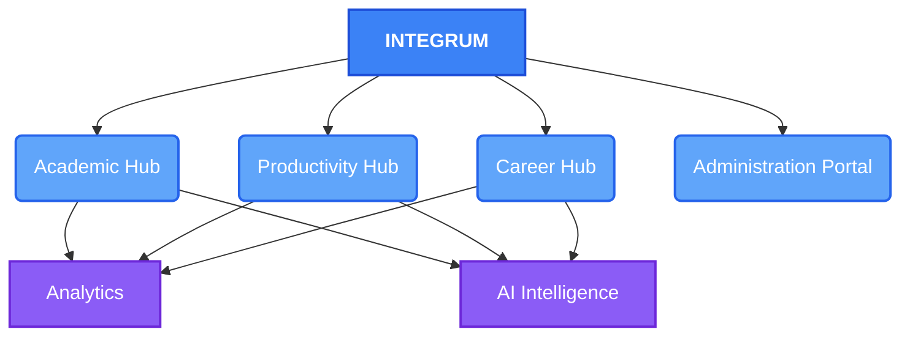

---

## 2. Why am I building it?

Currently, students experience extreme workflow fragmentation. The objective is to bring these disjointed tools into one unified student platform.

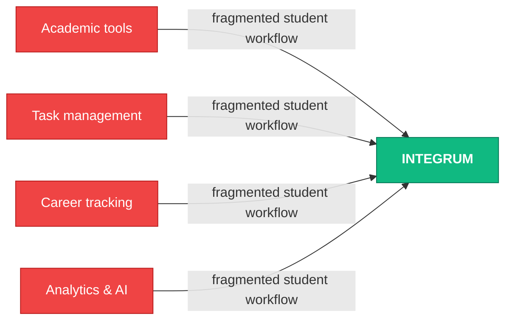

---

## 3. What have I designed?

Before writing code, I established a robust technical foundation to ensure the system scales elegantly.

### Core Domain Relationships
The domain model enforces ownership: student-specific data belongs to the appropriate student context.

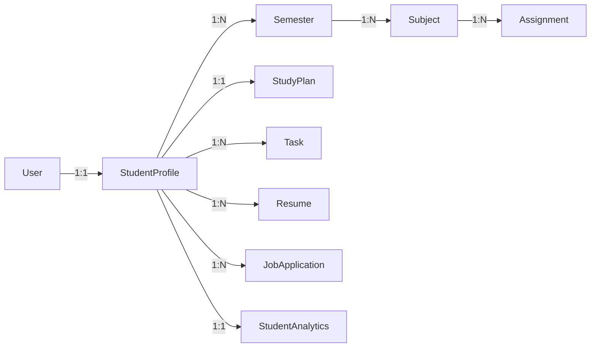

### System Architecture
A layered architecture where HTTP requests, business logic, and database access are strictly decoupled.

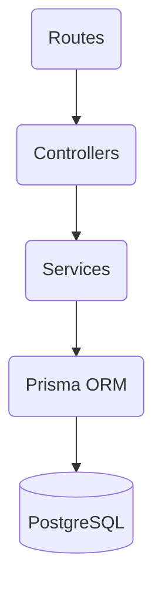

* **Routes** — endpoint mapping and middleware
* **Controllers** — HTTP request/response handling
* **Services** — business logic
* **Prisma** — data-access/ORM layer
* **PostgreSQL** — persistence

---

## 4. What have we actually implemented?

The design is no longer just conceptual documentation. 

### 4.1 Database Infrastructure
The schema has been successfully migrated to a local PostgreSQL database, establishing the real table structure (15 models, 9 enums).

### 4.2 Identity & Access

**Status:** ✅ Complete

The Identity & Access module provides secure authentication, authorization, and session management.

#### Implemented Components

| Component | Status | Key functionality |
|---|---|---|
| Registration | ✅ | Transactional account creation with automatic default semester assignment |
| Login | ✅ | Secure credential verification |
| JWT Access Tokens | ✅ | Secure API access via Bearer tokens |
| Refresh Token Lifecycle | ✅ | Secure rotation via `HttpOnly` cookie |
| Logout | ✅ | Securely clearing session cookies |
| RBAC | ✅ | Role-based authorization controls |
| Validation & Error Handling | ✅ | Graceful handling of duplicate emails (409 Conflict) and bad inputs (400 Bad Request) |

#### Working Software
- [x] Registration
- [x] Login
- [x] Protected API access (`/users/me`)
- [x] Token refresh
- [x] Logout
- [x] Validation & Error Handling

#### Verification
- [x] CRUD testing
- [x] Validation testing
- [x] Security testing (Auth/RBAC)
- [x] Invalid-resource handling

### 4.3 Academic Hub

**Status:** ✅ Complete

The Academic Hub provides the core ownership hierarchy and academic management tools for the student.

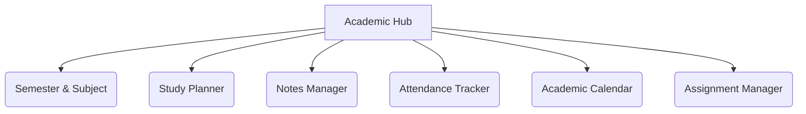

#### Implemented Components

| Component | Status | Key functionality |
|---|---|---|
| Semester Management | ✅ | CRUD + ownership |
| Subject Management | ✅ | CRUD + semester ownership |
| Assignment Manager | ✅ | CRUD + subject ownership |
| Study Planner | ✅ | CRUD + progress tracking |
| Notes Manager | ✅ | CRUD + tags and file metadata |
| Attendance Tracker | ✅ | Daily logging + percentage calculation |
| Academic Calendar | ✅ | Event creation + timeline mapping |

#### Working Software
- [x] Creating Semesters, Subjects, and Assignments with strict data isolation
- [x] Managing Study Plans and generating progress
- [x] Storing Notes with metadata
- [x] Tracking Subject Attendance
- [x] Managing Calendar Events

#### Verification
- [x] CRUD testing
- [x] Validation testing
- [x] Cross-user isolation
- [x] Invalid-resource handling
- [x] Regression testing

### 4.4 Productivity Hub

**Status:** ✅ Complete

The Productivity Hub focuses on immediate actionable items and schedule management for the student.

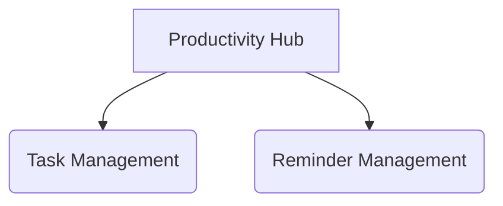

#### Implemented Components

| Component | Status | Key functionality |
|---|---|---|
| Task Management | ✅ | CRUD + ownership + status tracking |
| Reminder Management | ✅ | CRUD + ownership + trigger scheduling |

#### Working Software
- [x] Creating, updating, and fetching Tasks while verifying cross-user data isolation
- [x] Creating, updating, and fetching Reminders while verifying cross-user data isolation

#### Verification
- [x] CRUD testing
- [x] Validation testing
- [x] Cross-user isolation
- [x] Invalid-resource handling

### 4.5 Career Hub

**Status:** ✅ Complete

The Career Hub manages professional development artifacts and job applications.

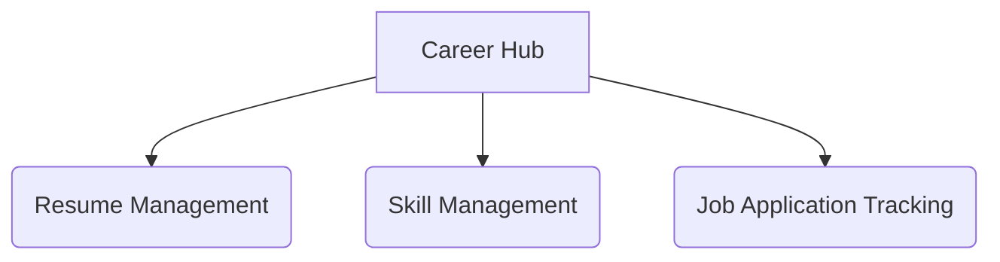

#### Implemented Components

| Component | Status | Key functionality |
|---|---|---|
| Resume Management | ✅ | Versioning, ATS scoring, feedback |
| Skill Management | ✅ | Tracking technical and soft skills |
| Job Application Tracking | ✅ | Application status, notes, pipeline |

#### Working Software
- [x] Creating, updating, and retrieving Resumes (including automatic version creation)
- [x] Creating, updating, and retrieving Skills with predefined categories
- [x] Creating, updating, and retrieving Job Applications with status tracking

#### Verification
- [x] CRUD testing
- [x] Validation testing
- [x] Cross-user isolation
- [x] Invalid-resource handling

### 4.6 Analytics Hub

**Status:** ✅ Complete

The Analytics Hub aggregates and analyzes data across the Academic, Productivity, and Career Hubs.

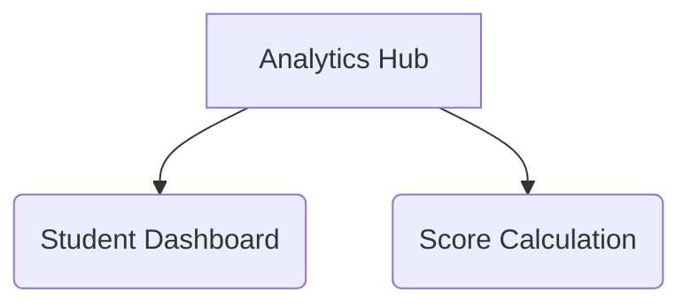

#### Implemented Components

| Component | Status | Key functionality |
|---|---|---|
| Student Dashboard | ✅ | Core metrics aggregation across modules |
| Score Calculation | ✅ | Multi-dimensional student performance score |

#### Working Software
- [x] Initial aggregate endpoints that compile existing database data
- [x] Cross-module calculations for assignments, attendance, tasks, and applications

### 4.7 AI Intelligence Hub

**Status:** ✅ Foundation & Study Plan Complete (Future slices planned)

The AI Intelligence Hub integrates language models to assist with learning and career development through AI-driven insights. While the core provider layer and study plan generation are complete, capabilities like Resume ATS analysis and Notes summarization remain future vertical slices.

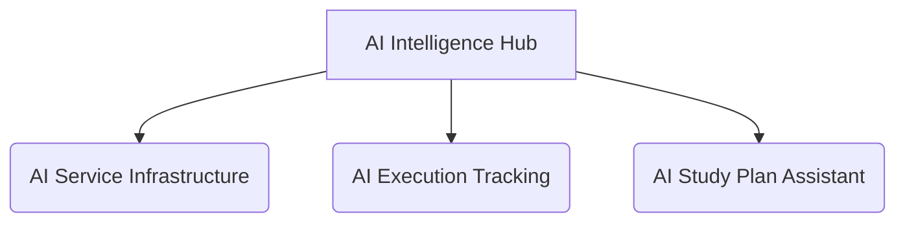

#### Implemented Components

| Component | Status | Key functionality |
|---|---|---|
| AI Service Infrastructure | ✅ | Abstracted service layer with validation, execution logging, and centralized error handling. |
| AI Execution Tracking | ✅ | Detailed logging of all interactions with language models across the platform. |
| AI Study Plan Assistant | ✅ | Concrete AI capability recommending structured study plans based on student context. |

#### Working Software
- [x] AI Execution Log tracking in PostgreSQL
- [x] Study Plan generation endpoint with student isolation
- [x] Real AI Integration using Google Generative AI (Gemini SDK)
- [x] Pluggable AI Provider Layer for Mock/Gemini swapping

#### Verification
- [x] Valid AI request generation
- [x] Invalid input and unauthorized request handling
- [x] Cross-user isolation and execution logging verification

### 4.8 Administration Portal

**Status:** ⏳ Planned

The Administration Portal will allow administrators to manage global settings, announcements, and university-level configurations.

#### Planned Components

| Component | Status | Key functionality |
|---|---|---|
| Admin Profile Management | ⏳ | Comprehensive department alignment and multi-tiered permissions tracking to ensure staff can safely access and configure specific segments of the university ecosystem. |
| Global Announcements | ⏳ | Broadcasting system notifications and urgent administrative alerts globally to all enrolled student profiles. |


## 5. Development Methodology

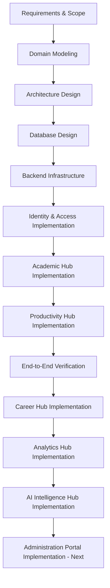

### What Comes Next?

The **Academic Hub**, **Productivity Hub**, **Career Hub**, **Analytics Hub**, and **AI Intelligence Hub** are fully implemented and verified. The next milestone is the **Administration Portal**, which will allow administrators to manage global settings and announcements.

### Current Status
| Area | Status |
| :--- | :--- |
| **Requirements & Scope** | ✅ Complete |
| **Domain Model & Architecture** | ✅ Complete |
| **PostgreSQL Database** | ✅ Complete |
| **Backend Infrastructure** | ✅ Complete |
| **Identity & Access Module** | ✅ Complete |
| **Academic Hub** | ✅ Complete |
| **Productivity Hub** | ✅ Complete |
| **Career Hub** | ✅ Complete |
| **Analytics Hub** | ✅ Complete |
| **AI Intelligence Hub** | ✅ Complete |
| **Administration Portal** | ⏳ Planned |

### Project Roadmap

Rather than a strict linear flow, the development focuses on the current priority hub, with remaining modules mapped as upcoming development.

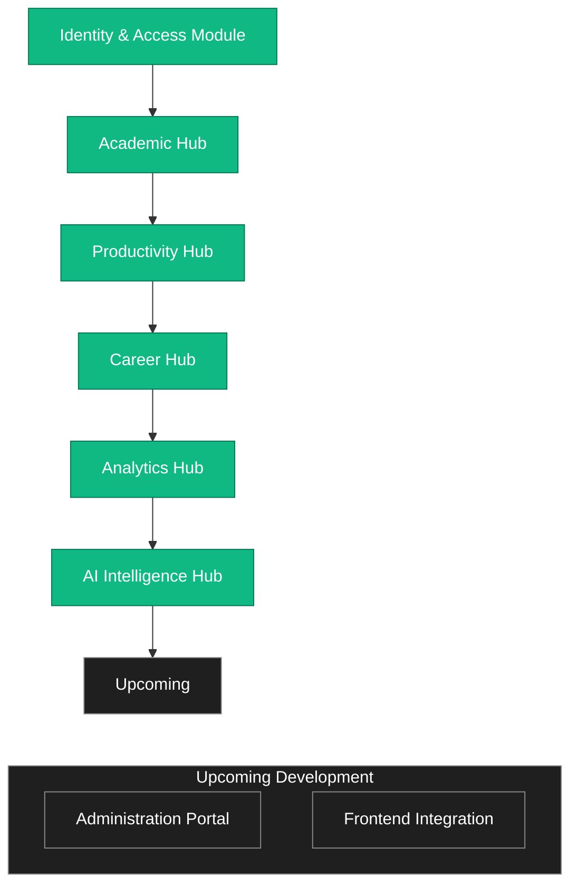

---

## 6. V1 Gap Closure — Systematic Audit & Remediation

> **Added 2026-08-20 / 2026-08-21** — After a full 105-functionality audit across all 26 features, we identified genuine backend gaps and systematically closed them in phases P1 through P5.

### 6.1 Audit Summary

| Result | Count |
|---|---|
| Fully implemented | 47 |
| Partial | 9 |
| Missing (real backend gaps) | ~23 (after removing 26 frontend/duplicate false positives) |

### 6.2 P1 — Identity & Access Gaps (commit `94fdb22`)

**What was missing and what we added:**

| # | Gap | What was built | Endpoint |
|---|---|---|---|
| I-1 | Forgot Password | Cryptographically random token, SHA-256 hash stored (not plaintext), 1-hour expiry, one-time use, generic response (no account enumeration) | `POST /auth/forgot-password`, `POST /auth/reset-password` |
| I-2 | Email Verification | Secure token, expiry, one-time use, resend capability, `isVerified` updated only on success | `POST /auth/verify-email`, `POST /auth/resend-verification` |
| I-3 | Update Profile | `PATCH /users/me` — firstName, lastName, university, enrollmentYear, graduationYear | `PATCH /users/me` |
| I-4 | Career Goals | `careerGoals String?` added to `StudentProfile` | Part of `PATCH /users/me` |
| I-5 | Social Links | `socialLinks Json?` added to `StudentProfile` (linkedin, github, portfolio, twitter) | Part of `PATCH /users/me` |
| I-6 | Upcoming Tasks | Filter: future-dated + not DONE, ordered by dueDate asc | `GET /tasks/upcoming` |

**Security decisions:**
- Reset tokens hashed with SHA-256 before DB storage — raw token only ever sent to user, never stored
- Forgot-password always returns the same message regardless of whether email exists, preventing account enumeration
- Email transport is development-grade (console log) — swap for Resend/SES in production without changing business logic

#### Verification
- [x] Forgot password: generic response confirmed (unknown email returns identical 200)
- [x] Reset password: token invalidated after use
- [x] Email verification: token one-time use confirmed
- [x] Profile update: careerGoals + socialLinks persisted and returned via GET /users/me
- [x] Upcoming tasks: DONE tasks excluded, past-due tasks excluded, ordering by dueDate confirmed
- [x] Cross-user task isolation: Student B cannot read or modify Student A's tasks

### 6.3 P2 — Academic Hub Gaps (commit `94fdb22`)

| # | Gap | What was built | Notes |
|---|---|---|---|
| A-1 | Task Priority | `priority Priority @default(MEDIUM)` on `Task` — reused existing `Priority` enum | `createTaskSchema` and `updateTaskSchema` updated |
| A-3 | Attendance Goal | `attendanceGoal Float?` on `Subject` (0–100%) | Validates 0–100 in Zod |
| A-4 | Attendance Report | Per-subject stats: totalClasses, attendedClasses, absentClasses, attendancePercentage, goal, goalDelta | `GET /attendance/report` |

**Bugfix discovered during P2:**
- `attendance.controller.ts` was using `req.user?.studentProfileId` (always `undefined`) instead of `req.user?.studentProfile?.id`. All five CRUD handlers were silently failing for ownership checks. Fixed to use the correct access pattern.

**Schema migration:** `20260820114243_v1_core_gaps_identity_academic`

Fields added to `User`: `passwordResetTokenHash`, `passwordResetExpires`, `verificationTokenHash`, `verificationExpires`  
Fields added to `StudentProfile`: `careerGoals`, `socialLinks`  
Fields added to `Subject`: `attendanceGoal`  
Fields added to `Task`: `priority`

#### Verification
- [x] Task priority: stored, returned, updated via PATCH
- [x] Upcoming tasks: correctly filters by dueDate > now AND status != DONE
- [x] Attendance goal: stored on Subject, returned in report
- [x] Attendance report: percentage, goal delta calculated correctly
- [x] Cross-user attendance isolation confirmed

### 6.4 P3 — Career Hub Gaps (commit `c0b3455`)

| # | Gap | What was built | Endpoint |
|---|---|---|---|
| C-1 | Resume Templates | `templateId String?` on `ResumeVersion`; 5 templates (classic/modern/minimal/executive/compact); changing template creates a new version | `GET /resumes/templates` |
| C-2 | Resume PDF Export | Returns structured JSON payload (templateId, content, versionId, atsScore, generatedAt) ready for a PDF rendering library | `GET /resumes/:id/pdf` |
| C-3 | Certifications | New `Certification` model — name, issuer, dateObtained, expiryDate, credentialId, credentialUrl | Full CRUD: `/certifications/*` |
| C-4 | Personal Projects | New `Project` model — title, description, technologies[], projectUrl, repoUrl, startDate, endDate, isOngoing | Full CRUD: `/projects/*` |
| C-5 | Interview Schedule | `interviewDate DateTime?` + `interviewRound String?` added to `JobApplication` | Part of `/job-applications/*` |
| C-6 | Offer Details | `offerDetails Json?` (salary, currency, benefits, deadline, notes) added to `JobApplication` | Part of `/job-applications/*` |

**Schema migration:** `20260821142706_v1_career_hub_p3`

New models: `Certification`, `Project`  
Modified: `ResumeVersion` (templateId), `JobApplication` (interviewDate, interviewRound, offerDetails)  
Relations added to `StudentProfile`: `certifications[]`, `projects[]`

#### Verification
- [x] Template list returns 5 templates
- [x] Resume created with templateId stored on version
- [x] Template switch creates new version, does not overwrite existing
- [x] PDF export data contains templateId, versionId, content, generatedAt
- [x] Cross-user PDF export blocked (404)
- [x] Certification CRUD: name, issuer, expiryDate stored and returned
- [x] Cross-user certification access blocked (404)
- [x] Project CRUD: technologies[] stored as array, isOngoing flag works
- [x] Cross-user project deletion blocked (404)
- [x] Interview date + round stored on job application
- [x] Offer details (salary, currency, benefits, deadline) stored as JSON
- [x] Cross-user job application access blocked (404)

### 6.5 P4 — Productivity Verification (commit `c0b3455`)

**Verification question:** Can certification renewal reminders be represented by the existing `Reminder` model, or do we need a new one?

**Answer:** Yes — the existing Reminder model is sufficient. The `GET /certifications/expiring?days=N` endpoint surfaces certifications nearing expiry. The frontend (or a background job) can use this to create Reminders via `POST /reminders` without any new backend model.

#### Verification
- [x] `GET /certifications/expiring?days=30` returns only certs with expiryDate > now AND <= now+30d
- [x] Certs with expiryDate > 30 days from now correctly excluded from the window
- [x] Generic Reminder model confirmed sufficient for renewal use case

### 6.6 P5 — Stabilization Checkpoint (commit `df9ea54`, pushed)

- [x] Full regression: `test-p1-p2.ts` — all assertions pass
- [x] Full regression: `test-p3-p4.ts` — all assertions pass
- [x] Prisma migrations reviewed: 4 migrations, clean history
- [x] API ownership/security reviewed: all data access gated at WHERE studentProfileId = authenticatedStudent
- [x] AI integration confirmed unaffected by resume schema changes (templateId is additive, not breaking)
- [x] `PROJECT_PROGRESS.md` updated (this section)
- [x] Committed and pushed to `main` on GitHub

### 6.7 What comes next (post P5)

```text
P1 Identity & Access         ✅ done
P2 Academic Hub              ✅ done
P3 Career Hub (C-1 → C-6)   ✅ done
P4 Productivity verification ✅ done
P5 Regression + Push         ✅ done

        ↓

AI Notes Assistant           ← next (POST /ai/notes/:id/summarize)
Analytics gaps               ← AN-1, AN-2, AN-3
Administration Portal        ← after core gaps fully closed
Frontend Integration         ← major final phase
```

The Administration Portal is intentionally deferred because it consumes data produced by the rest of the platform. Building it before the student-facing domain is complete would mean repeatedly changing its statistics endpoints and management screens as underlying data evolves.
