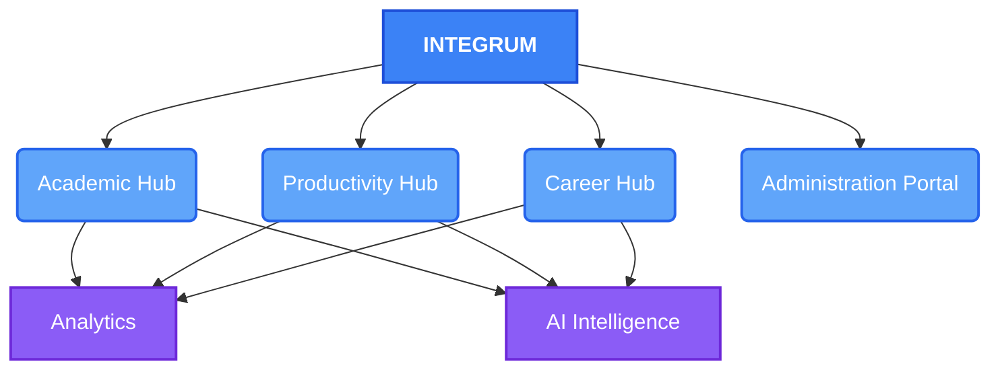
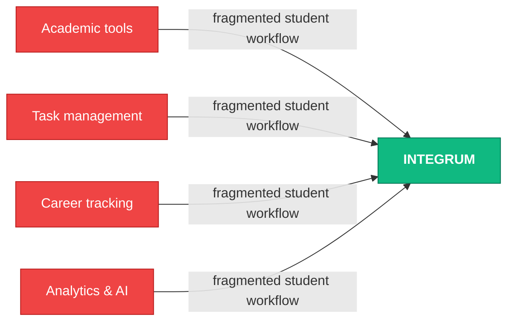
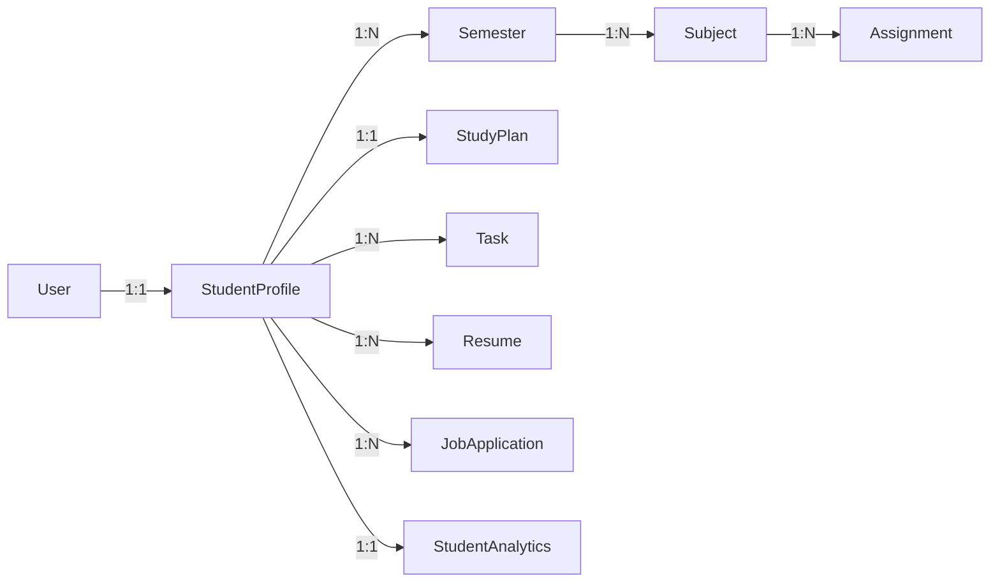
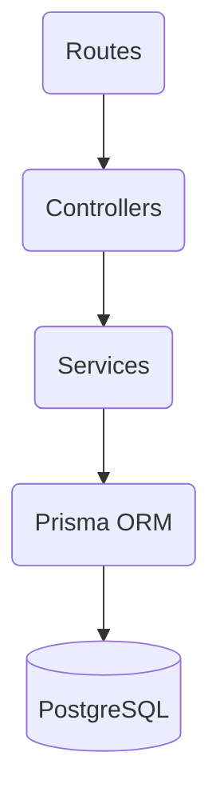
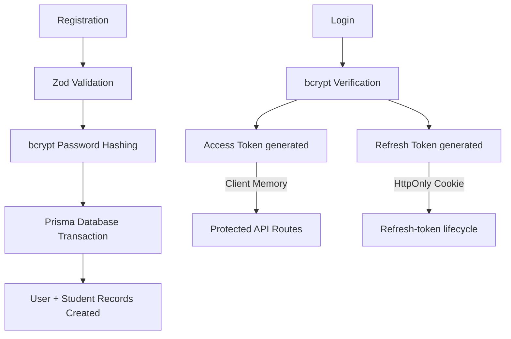
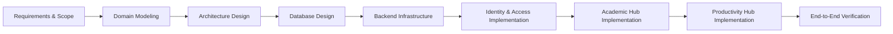

# Integrum — Mini Project Progress Review

> **From Problem Definition → System Architecture → Database → Working Authentication**

---

## 1. What am I building?

**Integrum** is an integrated student success platform combining academic management, productivity, career development, analytics, and AI intelligence around a unified student profile.



---

## 2. Why am I building it?

Currently, students experience extreme workflow fragmentation. The objective is to bring these disjointed tools into one unified student platform.



---

## 3. What have I designed?

Before writing code, I established a robust technical foundation to ensure the system scales elegantly.

### Core Domain Relationships
The domain model enforces ownership: student-specific data belongs to the appropriate student context.



### System Architecture
A layered architecture where HTTP requests, business logic, and database access are strictly decoupled.



* **Routes** — endpoint mapping and middleware
* **Controllers** — HTTP request/response handling
* **Services** — business logic
* **Prisma** — data-access/ORM layer
* **PostgreSQL** — persistence

---

## 4. What have I actually implemented?

The design is no longer just conceptual documentation. 

### Database Infrastructure
The schema has been successfully migrated to a local PostgreSQL database, establishing the real table structure (15 models, 9 enums).

### Complete Backend Authentication Flow
The first major backend feature—the **Identity & Access: Authentication Module**—is implemented and tested with the planned security controls.



---

## 5. Live Demonstration (Working Software)

> [!NOTE]
> *Switching to terminal/browser to demonstrate actual API workflows:*

- [x] **Registration:** Transactional account creation with automatic default semester assignment.
- [x] **Login:** Secure credential verification generating JWT access & refresh tokens.
- [x] **Protected API (`/users/me`):** Fetching the authenticated user's profile using a Bearer token.
- [x] **Refresh Token:** Using the secure `HttpOnly` cookie to rotate access tokens.
- [x] **Logout:** Securely clearing the session cookies.
- [x] **Validation & Error Handling:** Graceful handling of duplicate emails (409 Conflict) and bad inputs (400 Bad Request).
- [x] **Academic Hub (Ownership Hierarchy):** Creating Semesters, Subjects, and Assignments with strict data isolation.
- [x] **Productivity Hub (Tasks):** Creating, updating, and fetching Tasks while verifying cross-user data isolation.

---

## 6. Development Methodology



Each major development step follows SDLC phases: implemented incrementally, verified locally, and committed to Git as a separate logical change.

---

## 7. What comes next?

The authentication layer is now a working vertical slice of the architecture, and the Academic Hub foundation is now implemented and verified. The next milestone is the Productivity Hub.

### Current Status
| Area | Status |
| :--- | :--- |
| **Requirements & Scope** | ✅ Complete |
| **Domain Model & Architecture** | ✅ Complete |
| **PostgreSQL Database** | ✅ Complete |
| **Backend Infrastructure** | ✅ Complete |
| **Identity & Access Module** | ✅ Complete |
| **Academic Hub** | ✅ Complete |
| **Productivity Hub (Tasks)** | ✅ Complete |

### Project Roadmap

Rather than a strict linear flow, the development focuses on the current priority hub, with remaining modules mapped as upcoming development.

```mermaid
flowchart TD
    A[Identity & Access Module] --> B[Academic Hub]
    B --> C[Productivity Hub]
    C --> I[Upcoming]

    subgraph UpcomingDevelopment["Upcoming Development"]
        direction LR
        F[AI Intelligence Hub]
        D[Career Hub]
        E[Analytics Hub]
        G[Administration Portal]
        H[Frontend Integration]
    end

    %% Force Upcoming Development below the completed flow
    I ~~~ F

    style A fill:#10b981,stroke:#047857,color:#fff
    style B fill:#10b981,stroke:#047857,color:#fff
    style C fill:#10b981,stroke:#047857,color:#fff

    style I fill:#1f1f1f,stroke:#888,color:#fff

    style F fill:#1f1f1f,stroke:#888,color:#fff
    style D fill:#1f1f1f,stroke:#888,color:#fff
    style E fill:#1f1f1f,stroke:#888,color:#fff
    style G fill:#1f1f1f,stroke:#888,color:#fff
    style H fill:#1f1f1f,stroke:#888,color:#fff

    style UpcomingDevelopment fill:#1f1f1f,stroke:#888,color:#fff
