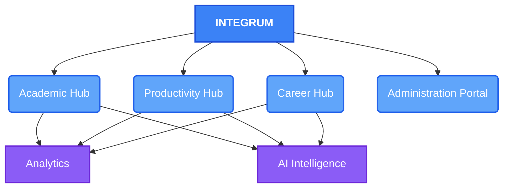
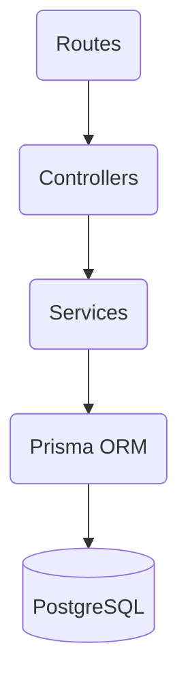
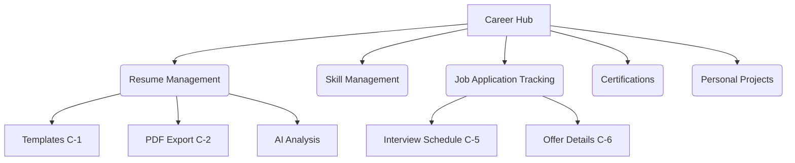
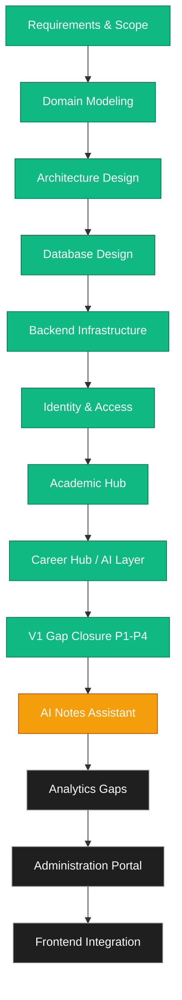

# Integrum — Mini Project Progress Review

> **From Problem Definition → System Architecture → Database → Working Backend Modules → V1 Gap Closure**

---

## 1. What am I building?

**Integrum** is an integrated student success platform combining academic management, productivity, career development, analytics, and AI intelligence around a unified student profile.

---

## 2. Why am I building it?

Currently, students experience extreme workflow fragmentation. The objective is to bring these disjointed tools into one unified student platform.

---

## 3. What have I designed?

Before writing code, I established a robust technical foundation to ensure the system scales elegantly.

### System Architecture
A layered architecture where HTTP requests, business logic, and database access are strictly decoupled.

* **Routes** — endpoint mapping and middleware
* **Controllers** — HTTP request/response handling
* **Services** — business logic
* **Prisma** — data-access/ORM layer
* **PostgreSQL** — persistence

---

## 4. What have we actually implemented?

### 4.1 Database Infrastructure

**Status:** ✅ Complete — 17 models, 9 enums, 4 migrations applied

| Migration | What it added |
|---|---|
| `20260806_initial` | Full 15-model schema, all enums |
| `20260819_v1_core_gaps` | Forgot-password tokens, verification tokens, careerGoals, socialLinks, attendanceGoal, task priority |
| `20260820_v1_identity_academic` | Full P1+P2 migration |
| `20260821_v1_career_hub_p3` | Certification, Project models; templateId on ResumeVersion; interviewDate, interviewRound, offerDetails on JobApplication |

### 4.2 Identity & Access

**Status:** ✅ Complete (V1 gap closure applied)

| Component | Status | Key functionality |
|---|---|---|
| Registration | ✅ | Transactional account creation + email verification token |
| Login | ✅ | Secure credential verification |
| Forgot Password | ✅ | Hashed token, expiry, generic response (no enumeration) |
| Reset Password | ✅ | Token validation, one-time use, invalidation on use |
| Email Verification | ✅ | Secure token, one-time use, resend capability |
| Update Profile | ✅ | PATCH /users/me — firstName, lastName, university, careerGoals, socialLinks |
| JWT Access Tokens | ✅ | Secure API access via Bearer tokens |
| Refresh Token Lifecycle | ✅ | Secure rotation via HttpOnly cookie |
| RBAC | ✅ | Role-based authorization controls |

### 4.3 Academic Hub

**Status:** ✅ Complete (V1 gap closure applied)

| Component | Status | Key functionality |
|---|---|---|
| Semester Management | ✅ | CRUD + ownership |
| Subject Management | ✅ | CRUD + attendance goal (A-3) |
| Assignment Manager | ✅ | CRUD + priority |
| Study Planner | ✅ | CRUD + AI integration |
| Notes Manager | ✅ | CRUD + tags + file metadata |
| Attendance Tracker | ✅ | Daily logging + per-subject report with % and goal delta (A-4) |
| Academic Calendar | ✅ | Events + timeline |
| Upcoming Tasks | ✅ | GET /tasks/upcoming — future-dated, non-done (I-6) |
| Task Priority | ✅ | priority field on Task (LOW/MEDIUM/HIGH) (A-1) |

### 4.4 Productivity Hub

**Status:** ✅ Complete + P4 verified

| Component | Status | Key functionality |
|---|---|---|
| Task Management | ✅ | CRUD + priority + upcoming filter |
| Reminder Management | ✅ | CRUD + trigger scheduling |
| Certification Renewal | ✅ | GET /certifications/expiring?days=N covers renewal without new model |

### 4.5 Career Hub

**Status:** ✅ Complete (V1 gap closure applied — C-1 through C-6)

| Component | Status | Key functionality |
|---|---|---|
| Resume Templates (C-1) | ✅ | 5 templates; templateId per version; GET /resumes/templates |
| Resume PDF Export (C-2) | ✅ | GET /resumes/:id/pdf — structured JSON for PDF rendering |
| Certifications (C-3) | ✅ | Full CRUD + expiry date + GET /certifications/expiring |
| Personal Projects (C-4) | ✅ | Full CRUD + technologies[] array |
| Interview Schedule (C-5) | ✅ | interviewDate + interviewRound on JobApplication |
| Offer Details (C-6) | ✅ | offerDetails JSON (salary, currency, benefits, deadline) |
| Skill Management | ✅ | CRUD + proficiency levels |
| AI Resume Analysis | ✅ | ATS scoring + structured feedback via Gemini |

### 4.6 Analytics Hub

**Status:** ✅ Complete

| Component | Status | Key functionality |
|---|---|---|
| Student Dashboard | ✅ | Core metrics aggregation across modules |
| Score Calculation | ✅ | Multi-dimensional student performance score |

### 4.7 AI Intelligence Hub

**Status:** ✅ Foundation Complete (Study Plan + Resume Analysis)

| Component | Status | Key functionality |
|---|---|---|
| AI Provider Abstraction | ✅ | IAIProvider → GeminiProvider / MockProvider |
| AI Execution Logging | ✅ | Full audit trail per AI call |
| AI Error Handling | ✅ | Maps 401/403/404/429/503 gracefully |
| Study Plan Assistant | ✅ | Gemini-powered structured study plan generation |
| Resume Analysis | ✅ | ATS scoring + feedback via Gemini |
| Zod Output Validation | ✅ | All AI outputs validated before DB persistence |

### 4.8 Administration Portal

**Status:** ⏳ Planned (after AI Notes Assistant and Analytics gaps)

---

## 5. V1 Gap Closure Progress

Audit performed: 105 functionalities across 26 features in 7 modules.

| Phase | Tasks | Status |
|---|---|---|
| P1 — Identity & Access | I-1 through I-6 | ✅ Done (commit 94fdb22) |
| P2 — Academic Hub | A-1, A-3, A-4 | ✅ Done (commit 94fdb22) |
| P3 — Career Hub | C-1 through C-6 | ✅ Done (commit c0b3455) |
| P4 — Productivity verification | Cert renewal reminders | ✅ Done (commit c0b3455) |
| P5 — AI Notes Assistant | AN-notes | ⏳ Next |
| P6 — Analytics gaps | AN-1, AN-2, AN-3 | ⏳ Planned |
| — Administration Portal | Full module | ⏳ After core gaps |
| — Frontend Integration | Full UI layer | ⏳ Final phase |

---

## 6. API Surface (Current)

| Module | Routes | Notes |
|---|---|---|
| Auth | `/auth/*` | register, login, refresh, logout, forgot-password, reset-password, verify-email, resend-verification |
| Users | `/users/*` | GET + PATCH /me |
| Semesters | `/semesters/*` | Full CRUD |
| Subjects | `/subjects/*` | Full CRUD + attendanceGoal |
| Assignments | `/assignments/*` | Full CRUD |
| Tasks | `/tasks/*` | Full CRUD + priority + /upcoming |
| Reminders | `/reminders/*` | Full CRUD |
| Study Plans | `/study-plans/*` | Full CRUD |
| Notes | `/notes/*` | Full CRUD |
| Attendance | `/attendance/*` | Full CRUD + /report |
| Calendar | `/calendar/*` | Full CRUD |
| Resumes | `/resumes/*` | Full CRUD + /templates + /:id/pdf |
| Skills | `/skills/*` | Full CRUD |
| Job Applications | `/job-applications/*` | Full CRUD + interview + offer |
| Certifications | `/certifications/*` | Full CRUD + /expiring |
| Projects | `/projects/*` | Full CRUD |
| Analytics | `/analytics/*` | Dashboard metrics |
| AI | `/ai/*` | Study plan + Resume analysis |

---

## 7. Development Methodology

### Current Status

| Area | Status |
| :--- | :--- |
| **Requirements & Scope** | ✅ Complete |
| **Domain Model & Architecture** | ✅ Complete |
| **PostgreSQL Database** | ✅ Complete (17 models, 4 migrations) |
| **Backend Infrastructure** | ✅ Complete |
| **Identity & Access (V1 gaps closed)** | ✅ Complete |
| **Academic Hub (V1 gaps closed)** | ✅ Complete |
| **Productivity Hub (V1 verified)** | ✅ Complete |
| **Career Hub (V1 gaps closed C-1→C-6)** | ✅ Complete |
| **AI Foundation + Study Plan + Resume** | ✅ Complete |
| **Analytics Hub** | ✅ Complete |
| **AI Notes Assistant** | ⏳ Next |
| **Analytics Gaps (AN-1, AN-2, AN-3)** | ⏳ Planned |
| **Administration Portal** | ⏳ Planned |
| **Frontend Integration** | ⏳ Final phase |
