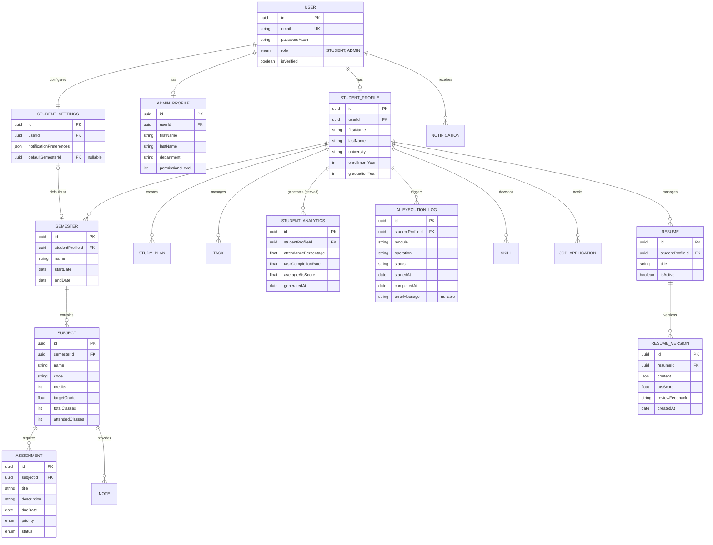

# Database Entity-Relationship Diagram (ERD)

This ER Diagram visually represents the relationships, ownership, and multiplicities defined in our frozen Domain Model. Please review this to ensure the database architecture perfectly aligns with our business requirements before we translate this into a Prisma schema.

## Entity Relationship Diagram

## Key Architectural Highlights:
1. **Ownership Principle Enforced**: You can visually trace the cascading ownership from `STUDENT_PROFILE` → `SEMESTER` → `SUBJECT` → `ASSIGNMENT` without redundant foreign keys.
2. **AI Extensibility**: The `AI_EXECUTION_LOG` tracks metadata independently, keeping the architecture clean and allowing future expansion for `AI_CONVERSATION` if needed.
3. **Resume Safety**: The `RESUME` entity acts as a container, while `RESUME_VERSION` holds the actual content history, preventing data loss.
